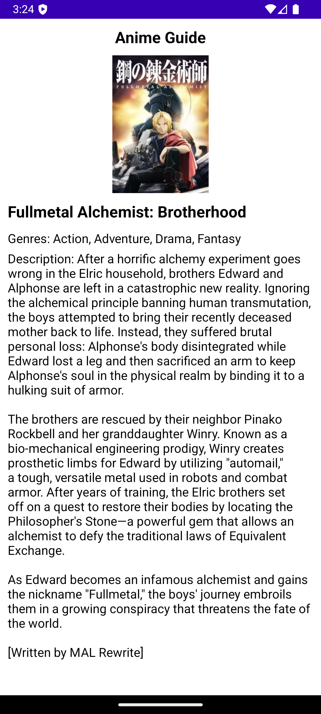
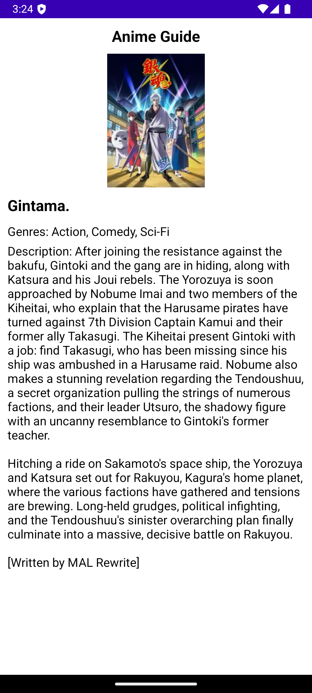

Clean architecture project structure
```
com.app.clean_architecture
├── presentation
│   ├── ui
│   ├── viewmodel
│   └── di
├── domain
│   ├── model
│   ├── usecase
│   └── repository
└── data
    ├── model
    ├── repository
    ├── local
    │   └── dao
    |   └── sp
    └── remote
        └── api
```





